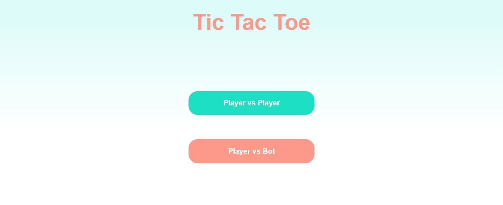
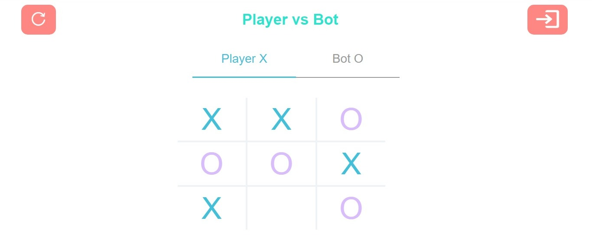
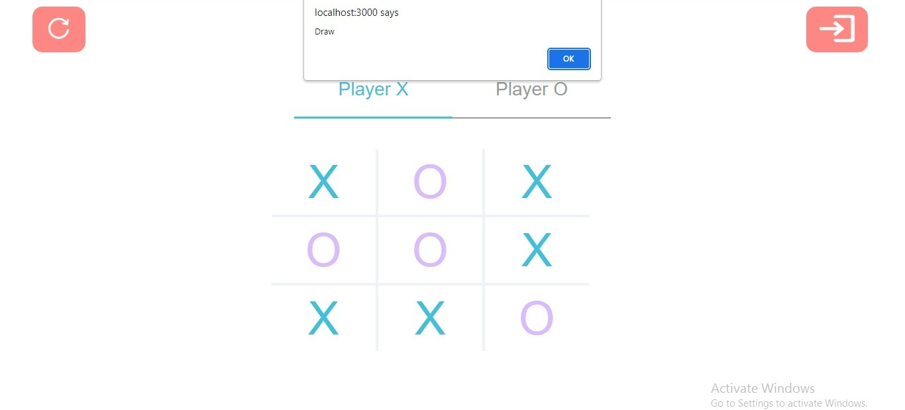

<h1>Tic Tac Toe - A web based game</h1>

Tic Tac Toe is a classic two-player game where players take turns marking spaces in a 3x3 grid with either X or O. The player who succeeds in placing three of their marks in a horizontal, vertical, or diagonal row wins the game.
This web-based version of Tic Tac Toe allows players to play against a bot or against another local player.

<h1>Preview</h1>
<h2><b>Demo:</b><a href="https://Mufthi-02.github.io/Tic-Tac-Toe/">https://Mufthi-02.github.io/Tic-Tac-Toe/</a></h2>
<h2>Home Page</h2>

<h2>Player vs Bot</h2>

<h2>Player vs Player</h2>

<h1>Features</h1>
<ul>
  <li>Play against a bot or against another local player</li>
  <li>Responsive design that adapts to different screen sizes</li>
  <li>Restart the game at any time</li>
  <li>Trained bot to play agaist player</li>
 </ul>
 <h1>Technologies Used</h1>
 
This project was built using the following technologies:

 <ul>
  <li>React js for the front end</li>
   <li>Vite Server</li>
 </ul>
 <h1>How to Run Locally</h1>
 
To run this project locally, follow these steps:

<ol>
  <li>Clone the repository:</li>
    
git clone https://github.com/Mufthi-02/Tic-Tac-Toe

    <li>Install the dependencies:</li>
    
cd Tic-Tac-Toe

  
npm install

  <li>Start the server:</li>
  
npm start

  <li>Open the game in your web browser:</li>
  
http://127.0.0.1:5173/Tic-Tac-Toe/

 </ol>
